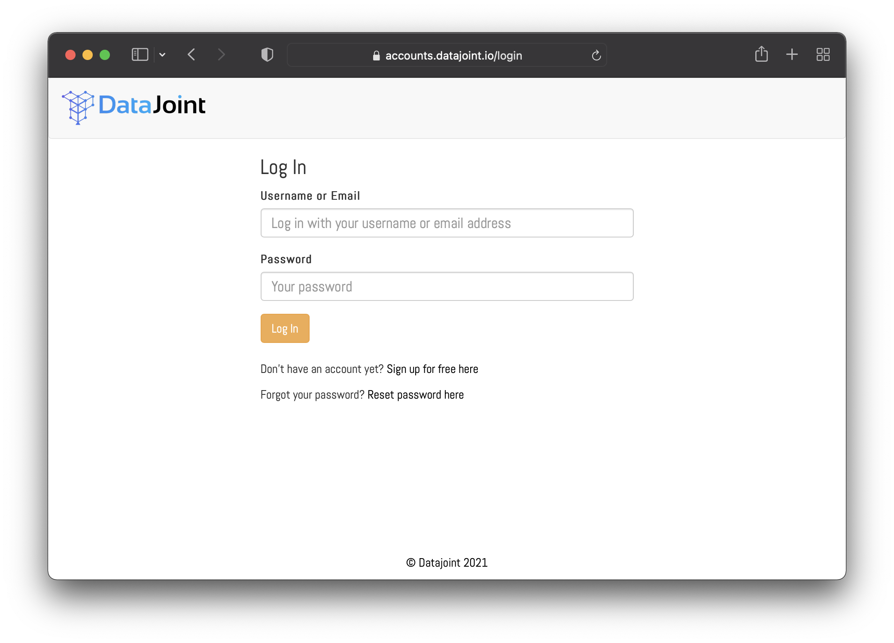
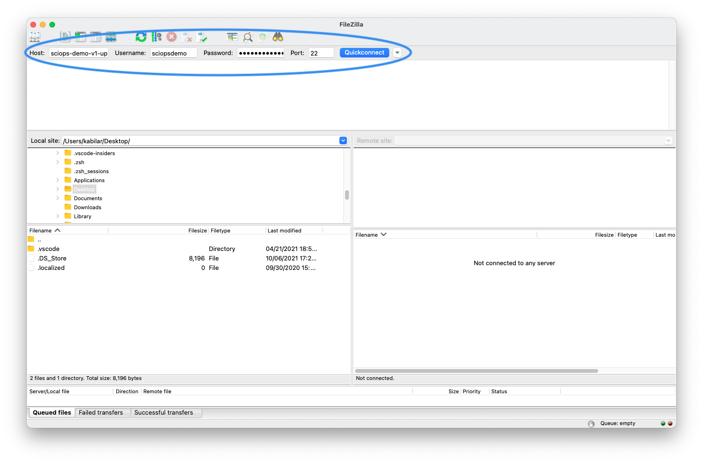
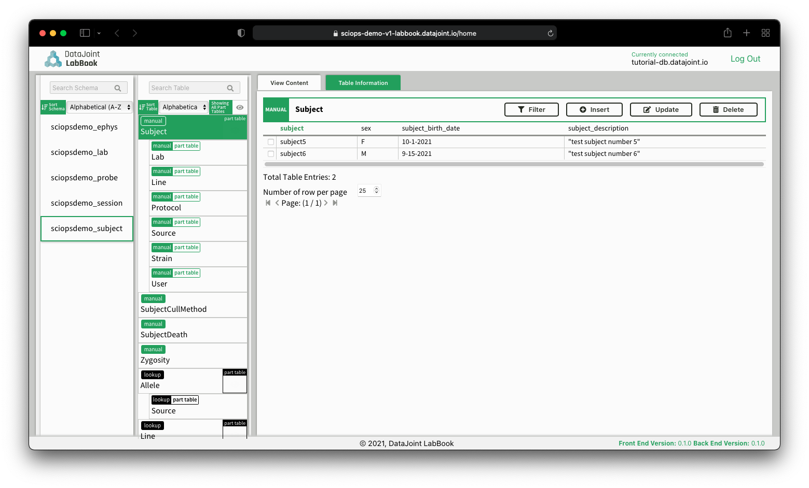
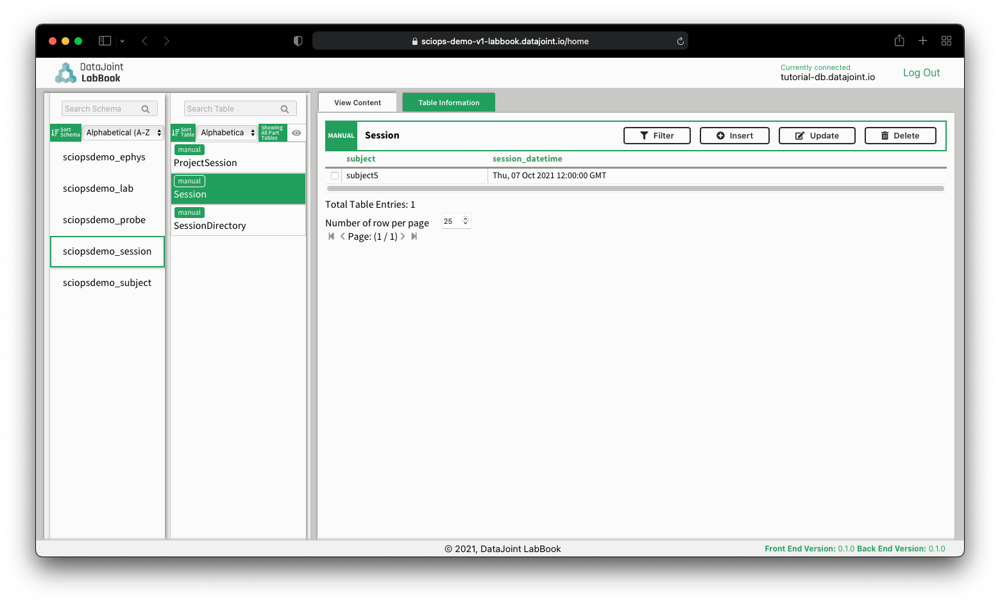

# Workflow for processing Neuropixels recordings with the Kilosort clustering method

+ Welcome to the SciOps cloud-based platform
    + This platform is designed for a user to upload their raw Neuropixels 
    data acquired with SpikeGLX, which will then automatically be processed
    with Kilosort 2.5.  The user can then use Jupyter notebooks to visualize the 
     results.
    + This 
    [workflow](https://github.com/ttngu207/sciops-demo-workflow-1)
    uses components from open-source packages, including the DataJoint Elements:
        + [element-lab](https://github.com/datajoint/element-lab)
        + [element-animal](https://github.com/datajoint/element-animal)
        + [element-session](https://github.com/datajoint/element-session)
        + [element-array-ephys](https://github.com/datajoint/element-array-ephys)
    + Please follow the steps listed below to begin working with the platform.

+ Create a free account at [datajoint.io](https://accounts.datajoint.io)
    + Please email us after you create this account so we can ensure your 
    account is configured properly.

    

+ Upload Neuropixels data
    + Download a sftp client, such as [Filezilla](
        https://filezilla-project.org/download.php?type=client)
    + Install Filezilla
    + Enter your credentials and press `Quickconnect`
        + Host: `upload.datajoint.io`
        + Username: <datajoint.io account username>
        + Password: <datajoint.io account password>
        + Port: 22

    

    + Your files should be in the following format, where the `subject`, 
    `session`, and `imec` directories can have any naming convention.
        ```
        inbox/
        └───subject1/
        │   └───session0/
        │   │   └───imec0/
        │   │   │   │   *imec0.ap.meta
        │   │   │   │   *imec0.ap.bin
        │   │   │   │   *imec0.lf.meta
        │   │   │   │   *imec0.lf.bin
        │   │   └───imec1/
        │   │       │   *imec1.ap.meta
        │   └───session1/
        │   │   │   ...
        └───subject2/
        │   │   ...
        ```
    + Within Filezilla, drag and drop your files from your local machine to the 
    cloud under the directory `inbox`.

+ Enter your experimental session metadata
    + Log in to [DataJoint LabBook](https://labbook.datajoint.io/)
        + Host: `tutorial-db.datajoint.io`
        + Username: <datajoint.io account username>
        + Password: <datajoint.io account password>

        

    + DataJoint LabBook displays data from your database
        + Left column - schemas
        + Middle column - tables within a schema
        + Right column - entries within a table
    + Enter subject information
        + In the left column, navigate to the `subject` schema
        + In the middle column, navigate to the `Subject` table
        + In the right column, `Insert` a new subject

        

    + Enter session information
        + In the left column, navigate to the `session` schema
        + In the middle column, navigate to the `Session` table
        + In the right column, `Insert` a new experimental session for the 
        subject

        

    + Enter session directory information
        + In the left column, navigate to the `session` schema
        + In the middle column, navigate to the `SessionDirectory` table
        + In the right column, `Insert` a new entry to identify where the data 
        is located (relative to the `inbox` directory)

        

+ Kilosort processing
    + Now the workflow will trigger Kilosort 2.5 to analyze your dataset with 
    default parameters.
    + Once your dataset is processed, you will receive an email.

+ Data exploration and visualization
    + Log in to the [DataJoint Jupyter environment](https://jupyter.datajoint.io/)
    + Navigate to the Jupyter notebook [01-explore](notebooks/01-explore.ipynb) 
    for examples on how to plot the processed data.

    

+ Please repeat the above steps to process additional datasets.

+ Thank you for using the DataJoint SciOps cloud-based platform.